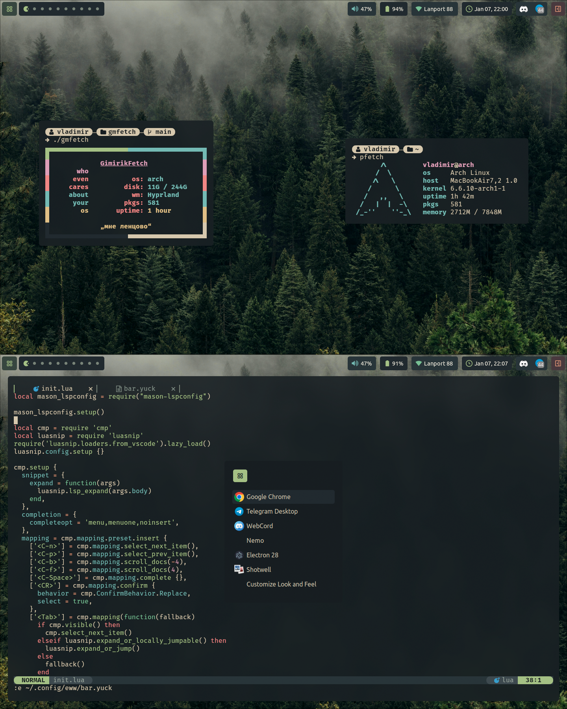

# Hyprland Everforest rice

## It's not done yet, so enjoy beta dotfiles :)

# Included:
- Hyprland config
- Hyprpaper config
- Eww config
- Rofi theme
- Zsh theme (for OhMyZSH)
- Neovim config

# Screenshots:

